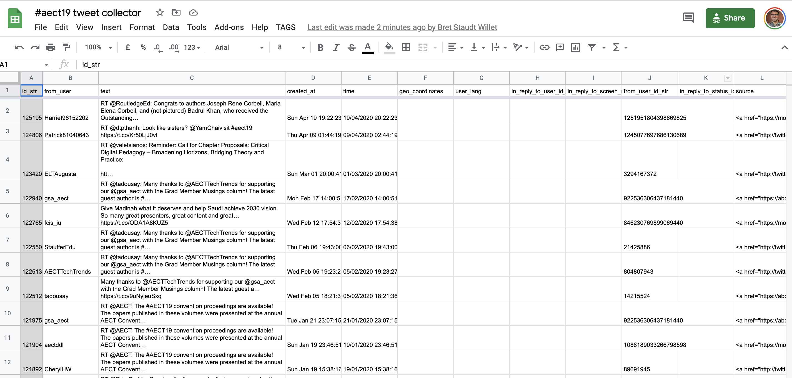
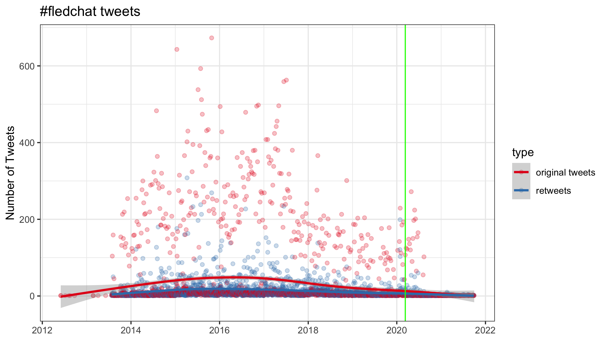
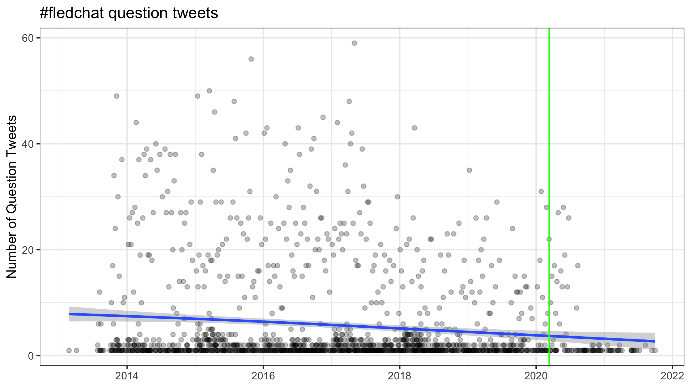

```{r setup, include=FALSE}
usethis::use_git_ignore(c("*.csv", "*.rds"))
options(htmltools.dir.version = FALSE)

library(knitr)
library(tidyverse)
library(xaringan)
library(fontawesome)
library(igraph)
library(tidygraph)
library(ggraph)
library(ggthemes)
library(cowplot)
library(kableExtra)
```

class: inverse, center, middle

# `r fa("far fa-images", fill = "#fff")`

**View the slides:** 

[bretsw.com/eme6356-fs22-module4](https://bretsw.com/eme6356-fs22-module4)

---

# `r fa("far fa-newspaper", fill = "#fff")` Data Stories

```{r, out.width = "360px", echo = FALSE, fig.align = "center"}

```

**"Your Seminoles are National Champions #OneTribe"**

(Tweet from [@FSUSoccer](https://twitter.com/FSUSoccer/status/1468066591120052226))

---

# `r fa("far fa-newspaper", fill = "#fff")` Data Stories

```{r, out.width = "540px", echo = FALSE, fig.align = "center"}
include_graphics("img/4-biomedical-analytics.jpg")
```

**"Pre-symptomatic detection of COVID-19 from smartwatch data"**

(Tweet from [@natBME](https://twitter.com/natBME/status/1329114238586064898))

---

# `r fa("far fa-newspaper", fill = "#fff")` Data Stories

```{r, out.width = "540px", echo = FALSE, fig.align = "center"}
include_graphics("img/4-biomedical-analytics.jpg")
```

- Journal article in [Nature Biomedical Engineering](https://www.nature.com/articles/s41551-020-00640-6)

--

- FSU Soccer uses [WHOOP bands](https://www.whoop.com/)

---

# `r fa("far fa-newspaper", fill = "#fff")` Data Stories

```{r, out.width = "600px", echo = FALSE, fig.align = "center"}

```

**Hurricane tracking from the [National Hurricane Center](https://www.nhc.noaa.gov/graphics_at4.shtml?cone)**

---

class: inverse, center, middle

# `r fa("thumbs-up", fill = "#fff")` <br><br> Module 3 Discussion <br> Themes and Kudos

---

# `r fa("thumbs-up", fill = "#fff")` Problem Conceptualization

```{r, out.width = "540px", echo = FALSE, fig.align = "center"}

```

**Wide variety of problems that could be addressed with analytics:**

--

- Students' attention span, motivation, retention

--

- Product deployment

--

- Relationship between cats' diet and kidney disease

---

# `r fa("thumbs-up", fill = "#fff")` Data Collection

```{r, out.width = "600px", echo = FALSE, fig.align = "center"}
include_graphics("img/data-collection-medium.jpg")
```

--

- Starting with a **clear problem** is absolutely vital: What do you want to know?

--

- What data will addressed the problem? What will help you find what you want to know?

---

# `r fa("thumbs-up", fill = "#fff")` Data Collection

```{r, out.width = "600px", echo = FALSE, fig.align = "center"}
include_graphics("img/data-collection-large.jpg")
```

- How much data do you need?

--

- How will manage to collect all of that data?

---

# `r fa("thumbs-up", fill = "#fff")` Data Analysis

```{r, out.width = "540px", echo = FALSE, fig.align = "center"}
include_graphics("img/data-analysis.jpg")
```

--

- How will you make sense of the data you've collected?

--

- Who could you ask to lend their expertise? (e.g., [FSU Statistical Consulting Center](https://stat.fsu.edu/consulting-center))

---

class: inverse, center, middle

# `r fa("fas fa-question", fill = "#fff")` <br><br> Module 3 Discussion <br> Final Thoughts?

---

class: inverse, center, middle

# `r fa("fas fa-chart-line", fill = "#fff")` <br> <br> Module 4: <br> Web Analytics

---

class: inverse, center, middle

# `r fa("fas fa-chart-line", fill = "#fff")` <br> <br> **Defining Analytics**

**Measure `r fa("fas fa-arrow-right", fill = "#fff")` Collect `r fa("fas fa-arrow-right", fill = "#fff")` Analyze `r fa("fas fa-arrow-right", fill = "#fff")` Report**

---

class: inverse, center, middle

# `r fa("fas fa-chart-line", fill = "#fff")` <br> <br> **Web Analytics**

**(Activity Online)**

---

# Activity Online

```{r, out.width = "600px", echo = FALSE, fig.align = "center"}
include_graphics("img/social-media-phone.jpg")
```

Measure `r fa("fas fa-arrow-right", fill = "#782F40")` Collect `r fa("fas fa-arrow-right", fill = "#782F40")` Analyze `r fa("fas fa-arrow-right", fill = "#782F40")` Report

--

### `r fa("fas fa-question", fill = "#fff")` **What might we measure?**

---

# Activity Online

```{r, out.width = "600px", echo = FALSE, fig.align = "center"}
include_graphics("img/social-media-phone.jpg")
```

- From whom do teachers seek professional advice?

--

- With whom do participants interact in Twitter hashtags?

--

- How did question asking change in the r/Teachers subreddit when doing school from home?

---

class: inverse, center, middle

# `r fa("fas fa-dice-one", fill = "#fff")` `r fa("fas fa-dice-two", fill = "#fff")` `r fa("fas fa-dice-three", fill = "#fff")` `r fa("fas fa-dice-four", fill = "#fff")` `r fa("fas fa-dice-five", fill = "#fff")` `r fa("fas fa-dice-six", fill = "#fff")`<br> <br> **Web Analytics** <br><br> Examples

---

# `r fa("fas fa-dice-one", fill = "#fff")` Web Analytics Example 1

### **Google Analytics**

```{r, out.width = "100%", echo = FALSE, fig.align = "center"}

```

[Google Analytics dashboard](https://analytics.google.com/analytics/web/)

---

# `r fa("fas fa-dice-two", fill = "#fff")` Web Analytics Example 2

### **Google BigQuery**

```{r, out.width = "100%", echo = FALSE, fig.align = "center"}
include_graphics("img/4-google-bigquery.png")
```

[Google BigQuery dashboard](https://console.cloud.google.com/bigquery)

---

# `r fa("fas fa-dice-three", fill = "#fff")` Web Analytics Example 3

### **Webpage JSON**

```{r, out.width = "100%", echo = FALSE, fig.align = "center"}
include_graphics("img/4-webpage-json.png")
```

[Reddit r/Teachers JSON](https://www.reddit.com/r/Teachers.json)

---

# `r fa("fas fa-dice-four", fill = "#fff")` Web Analytics Example 4

### **Reddit API**

```{r, out.width = "100%", echo = FALSE, fig.align = "center"}
include_graphics("img/4-reddit-api.png")
```

[Reddit API](https://github.com/bretsw/reddit-covid/blob/main/local-functions.R)

---

# `r fa("fas fa-dice-five", fill = "#fff")` Web Analytics Example 5

### **PoliDashboard: Facebook Polical Ads**

```{r, out.width = "420px", echo = FALSE, fig.align = "center"}
include_graphics("img/4-polidashboard.png")
```

[PoliDashboard from Social Media Lab](https://global.polidashboard.com/)

---

# `r fa("fas fa-dice-six", fill = "#fff")` Web Analytics Example 6

### **Twitter Archiving Google Sheets**

```{r, out.width = "100%", echo = FALSE, fig.align = "center"}

```

[Twitter Archiving Google Sheet (TAGS)](https://tags.hawksey.info/)

[TAGS collector for conference tweets](https://bit.ly/aect19tracker)

---

# `r fa("fas fa-dice-six", fill = "#fff")` `r fa("fas fa-dice-one", fill = "#fff")` Web Analytics Example 7

### **Twitter Academic API**

[Twitter API for Academic Research](https://developer.twitter.com/en/products/twitter-api/academic-research)

```{r, eval=FALSE}
library(academictwitteR)
library(tidytags)

tweets_json <- 
  academictwitteR::get_all_tweets(
    query = "#fledchat",
    n = 1500000,
    page_n = 500,
    start_tweet = "2006-03-21T00:00:00Z", 
    end_tweets = Sys.time(),
    bearer_token = Sys.getenv("TWITTER_BEARER_TOKEN"), 
    data_path = "data/"
  )

tweets_tidy <- 
  academictwitteR::bind_tweets(data_path = "data/", 
                               output_format = "tidy")

edchat_tweets <- 
  tidytags::lookup_many_tweets(tweets_tidy$tweet_id)
```

---

# `r fa("fas fa-dice-six", fill = "#fff")` `r fa("fas fa-dice-one", fill = "#fff")` Web Analytics Example 7

### **Twitter Academic API**

```{r, out.width = "100%", echo = FALSE, fig.align = "center"}

```

---

# `r fa("fas fa-dice-six", fill = "#fff")` `r fa("fas fa-dice-one", fill = "#fff")` Web Analytics Example 7

### **Twitter Academic API**

```{r, out.width = "100%", echo = FALSE, fig.align = "center"}

```

---

# `r fa("fas fa-dice-six", fill = "#fff")` `r fa("fas fa-dice-two", fill = "#fff")` Web Analytics Example 8

### **tidytags**

**R Package for Importing and Analyzing Twitter Data Collected with Twitter Archiving Google Sheets** 

```{r, out.width = "280px", echo = FALSE, fig.align = "center"}
include_graphics("img/4-tidytags-logo.png")
```

--

- [R package website](https://docs.ropensci.org/tidytags/)

--

- [GitHub repository](https://github.com/ropensci/tidytags)

---

# `r fa("fas fa-dice-six", fill = "#fff")` `r fa("fas fa-dice-two", fill = "#fff")` Web Analytics Example 8

### **tidytags** 

```{r, out.width = "280px", echo = FALSE, fig.align = "center"}
include_graphics("img/4-tidytags-logo.png")
```

- [Overview](https://docs.ropensci.org/tidytags/)

--

- **Guide 1:** [Getting started with tidytags](https://docs.ropensci.org/tidytags/articles/setup.html)

--

- **Guide 2:** [Using tidytags with a conference hashtag](https://docs.ropensci.org/tidytags/articles/tidytags-with-conf-hashtags.html)

---

# `r fa("fas fa-dice-six", fill = "#fff")` `r fa("fas fa-dice-two", fill = "#fff")` Web Analytics Example 8

### **tidytags workflow** 

```{r, out.width = "640px", echo = FALSE, fig.align = "center"}

```

---

# `r fa("fas fa-dice-six", fill = "#fff")` `r fa("fas fa-dice-three", fill = "#fff")` Web Analytics Example 9

### **Scraping a job board** 

```{r, out.width = "640px", echo = FALSE, fig.align = "center"}

```

**[Indeed.com](https://www.indeed.com/jobs?q=instructional%20design&l&from=searchOnHP&vjk=d912682f2c003369)**

---

# `r fa("fas fa-dice-six", fill = "#fff")` `r fa("fas fa-dice-three", fill = "#fff")` Web Analytics Example 9

### **Scraping a job board** 

```{r, out.width = "100%", echo = FALSE, fig.align = "center"}

```

**[Indeed.com](https://www.indeed.com/jobs?q=instructional%20design&l&from=searchOnHP&vjk=d912682f2c003369)**

---

# `r fa("fas fa-dice-six", fill = "#fff")` `r fa("fas fa-dice-three", fill = "#fff")` Web Analytics Example 9

### **Scraping a job board** 

```{r, out.width = "100%", echo = FALSE, fig.align = "center"}

```

**[Indeed.com](https://www.indeed.com/jobs?q=instructional%20design&l&from=searchOnHP&vjk=d912682f2c003369)**

--

**Guide: [A Detailed Guide to Web Scraping Indeed Jobs With R and rvest](https://thatdatatho.com/web-scraping-indeed-jobs-r-rvest/)**

---

class: inverse, center, middle

# `r fa("fas fa-question", fill = "#fff")` <br><br> **What might we measure?**

---

class: inverse, center, middle

# `r fa("fas fa-binoculars", fill = "#fff")` <br><br> Looking ahead

---

# `r fa("fas fa-calendar-day", fill = "#fff")` Semester schedule

```{r, out.width = "720px", echo = FALSE, fig.align = "center"}
include_graphics("img/across-time.jpg")
```

- **Module 4: Web Analytics**
- **Module 5:** Data Visualization
- **Module 6:** Ethics in Learning Analytics
- **Module 7:** Future of Analytics
- **Module 8:** Case Discussions

---

# `r fa("fas fa-calendar-day", fill = "#fff")` Major Assignments

```{r, out.width = "480px", echo = FALSE, fig.align = "center"}
include_graphics("img/build.jpg")
```

### Analytics Assignments (60%)

--

- Analytics Problem Plan (100 points)

--

- **Analytics Practice (200 points) - due end of Module 5**

--

- Analytics Case Presentation (200 points; group project)

--

- Analytics Ethics Statement (100 points)

---

class: inverse, center, middle

# `r fa("fas fa-question", fill = "#fff")` <br><br> Questions

<hr>

**What questions can I answer for you now?**

**How can I support you this week?**

<hr>

`r fa("envelope", fill = "#fff")` [bret.staudtwillet@fsu.edu](mailto:bret.staudtwillet@fsu.edu) | `r fa("twitter", fill = "#fff")` [@bretsw](https://twitter.com/bretsw) | `r fa("globe", fill = "#fff")` [bretsw.com](https://bretsw.com) | `r fa("fab fa-github", fill = "#fff")` [GitHub](https://github.com/bretsw/)